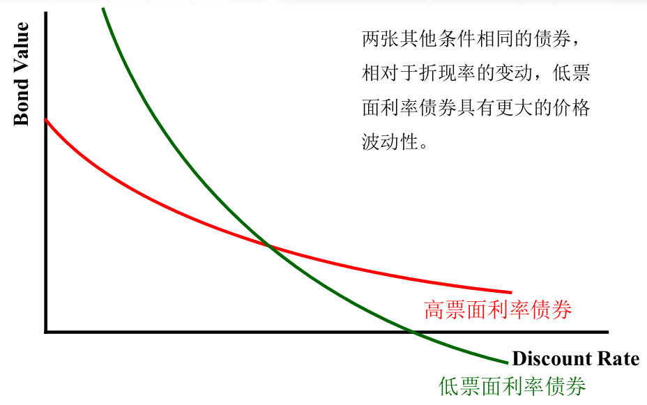

## 第一章 概论
### 1.1 什么是公司金融
- Def:
帮助公司作投资和融资的决策(连接资金的供给方S和资金的需求方I的一个中介)

- 三个基本问题:
#1. 公司应投资于什么样的长期资产(如: 生产汽车、生产衣服等)---资本预算或资本支出

#2. 公司如何筹集资本支出所需的资金(如: 银行贷款、股权债权融资等)---资本结构

#3. 公司如何管理经营中的现金流量---营运资本管理或短期债务管理

- 资本决策
```           
             +----------+     +----------+                        +----------+
      +----->| 流动资产 |-----| 营运资本 |----------+-------------| 流动负债 |---------------+
      |      +----------+     +-----+----+          |             +----------+               |
      |                             |               |                                        |
      |                        短期资产应如何    企业应该                                    v
+-----+----+                   管理和融资        如何对所         +----------+          +----------+
| 公司资产 |                                     做的投资---------| 长期负债 |--------->| 资金来源 |
+-----+----+                                     进行筹资         +----------+          +----------+
      |                                             |                                        ^
      |                                             |                                        |
      |    +--------------+                         |                                        |
      +--->|  固定资产    | 企业应进                |                                        |
           |  1.有形资产  | 行什么样                |             +----------+               |
           |  2.无形资产  | 的长期投资              +-------------| 股东权益 |---------------+
           +--------------+                                       +----------+


公司资产 = 负债 + 权益
净营运资本 = 流动资产 - 流动负债(一般 > 0)
```

- 资本预算决策 := 企业应进行什么样的长期投资
- 资本结构决策 := 企业应如何对所作的投资进行筹资(MM定理 权衡理论等)


### 1.2 企业的组织形式
- 四种组织形式
#1.个人独资企业
#2.合伙制企业
#3.有限责任公司
#4.股份有限公司
```
[注]: 3 4 又称为公司制企业
```
#[1].个人独资企业
  - 由个人经营和拥有
  - 一般没有雇员或只有少数
  - 优: 
    1. 设立简单
    2. 监管负担轻
    3. 只需缴纳个人所得税
  - 缺:
    1. 个人无限责任
    2. 生命期有限
    3. 资本权益受所有者个人财务限制
    4. 权益流动性差

#[2].合伙制企业
  - 与个人独资企业类似, 但所有人不止一人
  - 所有合伙人都对企业的负债负有连带责任(即: 债权人可以要求任何一个合伙人偿还企业所有债务)
  - 任何一个合伙人死亡或撤资, 都会导致合伙企业的终止
  - 例:
    1. 风险投资基金(PE/VC): 有限合伙制

  - 优:
    1. 公司资本数量不受单个所有者财富的限制
    2. 发起相对容易
    3. 只交纳个人所得税
  - 缺:
    1. 承担无限责任
    ```
    普通合伙制(所有合伙人都要承担无限责任)

    有限合伙制
      - 普通合伙人(有经营管理权, 承担无限责任)
      - 有限合伙人(无经营管理权, 以出资额承担有限责任)
    ```
#[3].有限责任公司(LLC)
  - 全部所有者都负有限责任, 并且参与企业经营
  - 在美国, 有限责任公司相对比较新型

#[4].股份有限公司
  - Def: 一个与公司所有者相分离的法人或法律实体(即: 公司是一个法人)
    * 和自然人一样享有很多法律权利(如: 签订合同, 获得资产, 承担义务和责任)
    * 股份有限公司独自负责偿付公司的自身债务。公司所有者对公司涉及的任何债务都不承担责任
  - 所有权:
    * 以股票为代表
    * 股票所有者被称为(以下都通用):
      > 股东(Shareholder/Stockholder)
      > 权益持有人(Equity Holder)
        -[Tips]: 比较相关概念 利益相关者(Stakeholder)

    * 所有股份的总和被称为权益(Equity)
    * 股东无人数限制(故可向外部投资者出售新股进行筹资)
    * 股东有权分得红利
    * 税负: 双重征税(个人所得税和公司所得税)

  - 优:
    1. 承担有限责任
    2. 公司的寿命无限
    3. 所有权和经营权分离
    4. 所有权可流通
    5. 融资容易
  - 缺:
    1. 双重税负
    2. 所有权和经营权分离会带来代理问题


### 1.3 财务管理的目标
  - 公司在金融市场中的角色和地位
```
      +--------------+                                       +-------------+
      |     企业     |<-----企业发行债券收到的现金(A)--------|   金融市场  |
      |              |<---留存现金(E)-+                      |             |
      |   企业投资   |                |                      |   短期负债  |
      |   的资产(B)  |                ^                      |   长期负债  |
      |              |---企业创造的-->|---股利和债务支付(F)->|   权益资本  |
      |   流动资产   |  现金流量(C)   v                      |             |
      |   固定资产   |                |                      +-------------+
      +--------------+              税收(D)                   企业对金融市场
          资产总价值                  |                       投资者的总价值
                                      v
                                  +-------+
                                  |  政府 |
                                  +-------+
```
  - 公司的财务管理目标
    A. 利润最大化?(x 存在短视问题)
    B. 成本最小化?(x 存在短视问题)
    C. 市场份额最大化?(x 利润不一定最大化)
    D. 最大化公司股票的当前价值?(o 最大化股东的利益)
    [tips]: 今天的股票价值反应是未来的可得的信息

  - 一般描述: 最大化现有所有者权益的市场价值
  [tips]: 公司理财 Def: 研究企业决策和企业股票价值的关系(value = f(policy))

  - 财务经理使公司增值途径
    1. 选择增值项目
    2. 理性融资决策

### 1.4 代理问题
  - 公司管理团队
    1. 在股份有限公司中, 所有权和直接控制权一般是分离的
    2. 董事会(有股东选举产生, 拥有最终决策权)

  - 首席执行官(CEO)
    * 被董事会授予日常的经营决策权

  - 所有权和控制权分离的优缺点
    * 优:
      1. 从多种业务经营中受益(多元化)
      2. 可以充分利用专业化优势(竞争优势)
      3. 所有权容易转移(不依赖控制权)
    * 缺:
      1. 代理问题(管理者和股东利益不一致)

  - 代理问题
    * Def: 股东(委托方)和管理者(代理方)之间存在利益上的冲突, 被称为代理问题
    * 代理成本:
      1. 直接代理成本:
        管理者受益, 股东受损
        监督管理者行为的支出成本
      2. 间接代理成本:
        失去机会

## 第二章 货币的时间价值

### 2.1 终值与复利
  - 时间线
    def: 对预期现金流的发生时期的线性图形描述
    几何意义:
    ```
          Date 0       year 1       1         year 2      2
               |--------------------|---------------------|-----> t
     Cash Flow $0                 $10,000               $10,000
            Today             End Year 1-Begin Year 2
    ```
    现金流入(Inflow):  +
    现金流出(Outflow): -
    时间移动的三条规则:
      1) 只有在同一时间点上才可以比较或合并
      2) 要在时间线上前移现金流需进行终值贴现计算: FV = C*(1 + r)^n
      3) 要在时间线上后移现金流需进行现值贴现计算: PV = C/((1 + r)^n)

  - 终值
    def: 时间线上后期的钱

  - 利率
    def: 早期的钱与后期的钱的兑换率

  - 复利
    def: 利滚利

### 2.2 现值与贴现
  - 现值
    def: 时间线上早期的钱
    多期现值:
      PV = C/((1 + r)^n)
    系列现金流的现值:
      PV = sum(n->N, C/((1 + r)^n))

  - 净现值(NPV)
    def: 衡量现金流入(收益)的现值与现金流出(成本)的现值之差
    NPV = PV_I - PV_O
    该指标有助于评估投资决策


### 2.3.1 年金估值
  - 年金(annuity)
    def: 在N期里定期发生的一系列等额现金流
    普通年金: 现金流发生在期末
    先付年金: 现金流发生在期初(或称期初年金)
    现值系数: 在r的利率下作用到t年的一块钱, 今天的价值
      1 / ((1 + r)^t)
    终值系数: 在r的利率下1块钱作用到t年后的价值
      (1 + r)^t - 1
    几何意义:
    ```
             C        C        C
    |--------|--------|--------|-----> t
    0        1        2        n
    ```
    年金现值:
      PV = C(1/((1+r)^1) + 1/((1+r)^2) + ... + 1/((1+r)^n))
      PV = C/r * [(1 - 1/((1+r)^t))]
    年金终值:
      FV = C/r * ((1 + r)^t - 1)

  - 增长年金
    def: 初始现金流为C, 增长率为g, 利率为r的n期增长的年金
    几何意义:
    ```
             C        C*(1+g)        C*(1+g)^(n-1)
    |--------|--------|-----...------|------> t
    0        1        2              n
    ```
    现值公式:
      PV = C/(r - g) * (1 - ((1+g)/(1+r))^n)

### 2.3.2 永续年金估值
  - 永续年金
    def:定期发生一系列等额的现金流, 并且永远持续
    eg: 优先股
    几何意义:
    ```
             C        C              C
    |--------|--------|-----...------|-----...-> t
    0        1        2              n
    ```
    现值推导:
      PV = C(1/((1+r)^1) + 1/((1+r)^2) + ... + 1/((1+r)^n))
      n->无穷
      等比数列求和再求极限
    永续年金现值:
      PV = C/r

  - 增长型永续年金
    def: 永续年金以固定比例g增长
    几何意义:
    ```
             C        C*(1+g)        C*(1+g)^(n-1)
    |--------|--------|-----...------|-----...-> t
    0        1        2              n
    ```
    现值公式:
      PV(增长型永续年金) = C / (r - g)

### 2.4 贷款的种类
  - 纯贴现贷款
    def: 借款人今天获得贷款, 未来某个时间一次性支付总额
    eg: 美国的国库券(T bills)

  - 附息贷款
    def: 每期付息, 到期还本(若n=1期, 即为纯贴现贷款)

  - 按揭贷款(Amortized Loan)
    def: 每期偿还金额包括本金+利息
    eg: 房贷款
    类型:
      1.等额本金法 2.等额本息法


## 第三章 债券估值
### 3.1 主要投资工具介绍
```
              +----------+
              | 金融市场 |------融资场所
              +----------+
                    |
            +--------------+
            |              |                +----------------+
            |              |        +-------| 中长期信贷市场 |
            v              v        |       +----------------+
      +----------+    +----------+  |
      | 货币市场 |    | 资本市场 |--+
      +----------+    +----------+  |
        一年以内        一年以上    |       +----------+
                                    +-------| 证券市场 |
                                            +----------+
```
  - 货币市场
    def: 投资工具在一年以内
    eg:
      1.国库券(T Bills)
      2.大额可转让存单(CD)
      3.商业票据
      4.欧洲美元
      5.回购协议
      ...

  - 资本市场
    def: 投资工具在一年以上
    eg:
      1.股票
      2.债券
      3.衍生证券
      4.投资基金
      5.私募股权/风险投资
      ...

  ```
  +---------------------------------------------------------------+
  |         | 潜在风险       | 潜在收益      | 股息或利息的现金流 |
  +---------------------------------------------------------------+
  |  债券   |      low       |      low      |        high        |
  +---------------------------------------------------------------+
  |  股票   |  medium/high   |  medium/high  |        low         |
  +---------------------------------------------------------------+
  | 衍生证券|     higher     |     higher    |        none        |
  +---------------------------------------------------------------+
  ```

  - 债权与股权的区别
    债权:
      1. 与所有权无关
      2. 债权人不具有投票权(表决权)
      3. 利息可在税前扣除
      4. 公司未能按时支付利息或本金时, 债权人具有索取权
      5. 负债过高可能会陷入财务困境并加大破产风险

    股权:
      1. 代表所有权
      2. 普通股东具有投票权和表决权
      3. 股利不可在税前扣除
      4. 股利支付不会构成法定义务
      5. 股权不会对公司造成破产风险

  - 衍生证券
    定价: 衍生证券的价格取决于标的资产的价格

### 3.2 债券的概念与定价
  - 债券
    def: 借贷双方之间签订的法律协议, 发行者有法律责任在指定日期向债券持有人支付特定金额

  - 债券凭证
    def: 表明债券的条款

  - 息票
    def: 承诺的利息支付

  - 期限
    def: 偿还日之前的剩余是时间

  - 面值(Face Value)
    def: 用来计算利息支付的名义金额

  - 息票利率
    def: 确定每次息票利息支付的数额, 表示为(APR)

  - 息票支付
    每次息票支付(CPN) = (FV * 息票利率) / 每年息票支付的次数
        CPN = FV * APR / t

  - 定价步骤
    所有的金融资产定价都有两步
    1.确定现金流的数量和时间;
    2.用合适的折现率

  - 零息债券(纯贴现债券)
    def: 没有息票支付
    eg: 国库券(T Bills)
    现金流:
    ```
    |------|------|--...-|--> t
    0      1      2      n
   -p      0      0     FV

    ```
    到期收益率(YTM or y):
      def: YTM = 资本利得(or 资本损失) + 利息收益率(Coupon Rate)
      定价: P = FV / (1 + y)^n
      Therefore: y = power(FV/P, 1/n) - 1

  - 息票债券(Coupon Bonds)
    def: 定期支付利息, 到期日支付面值(tips: 利息和票面面值分离)
    现金流:
    ```
    |------|------|--...-|--> t
    0      1      2      n
   -P     CPN    CPN  FV + C*r
    ```
    到期收益率(YTM or y):
      定价: P = CPN/y * (1 - 1/(1+y)^n) + FV/(1+y)^n
      P: 债券价格
      CPN: 息票支付(CPN = FV * r / n)
      y: 到期收益率
      FV: 面值

  - 中期国债(T Notes)
    def: 原始到期期限为1-10年的美国财政部的息票债券

  - 长期国债(T Bonds)
    def: 原始到期期限超过10年的美国财政部的息票债券

  - 债券价格的动态表现
    折价(Discount): 债券价格低于债券面值(P < FV; y > APR)
    平价(Par): 债券价格等于债券面值(P = FV; y = APR)
    溢价(Premium): 债券价格高于债券面值(P > FV; y < APR)

  - 时间对债券价格的影响
    1. 其他条件不变, 债券的到期收益率(y)不会随时间而改变
    2. 其他条件不变, 折价或溢价债券的价格将随时间向平价(面值)趋近
    

  - 利率对债券价格的影响
    利率与债券价格存在反向关系(r+ -> P-; r- -> P+)
    

    

    

  - 久期
    def: 衡量债券价格对利率的敏感性
    含义: 以PV(C_t) / P为权重的每笔现金流的发生时期t的加权平均值
    久期越长, 债券价格对利率越敏感
    久期越短, 债券价格对利率越不敏感
    债券久期的计算公式:
      久期 = sum(t * PV(C_t) / P)
      C_t为t期的现金流, PV(C_t)为其现值, P=sum(PV(C_t))所有现金流的总现值

  - 公司债券
    由公司发行, 存在违约风险
    结论:
      1.信用风险与债券价格的关系(信用风险+ -> 债券价格-)
      描述: 投资者对于具有信用风险的债券所支付的价格，要低于他们对其他方面相同的
            无违约风险所支付的价格(一价定律)
      2.信用风险与债券收益率的关系(信用风险+ -> 收益率-)
      描述: 具有信用风险的债券收益率要高于其他方面相同的无违约风险的债券的收益率

  - 信用风险(由低到高)
    1.无违约
    2.(存在)违约风险
      债券价格较低, 到期收益率较高
    3.确定违约
      利用一价定律, 参考其他同条加无违约风险的债券价格进行定价
      债券价格低, 到期收益率高

  - 违约息差(or 信用息差)
    def: 公司债券的收益率与国债的收益率之间的差额

  - 债券评级
    投资级----> 高等级: 穆迪的Aaa和标准普尔的AAA, 偿还能力非常强;
          |             穆迪的Aa和标准普尔的AA, 偿还能力很强
          +---> 中等级: 穆迪的A和标准普尔的A, 偿还能力强, 但容易受环境影响;
                        穆迪的Baa和标准普尔的BBB, 有偿还能力, 且可能受到不利条件影响
    投机级----> 低等级: 穆迪的Ba, B和标准普尔的BB和B, 偿还能力有可能恶化;
          |
          +---> 极差级: 穆迪的C(及以下)和标准普尔的C(及以下), 无能力支付利息或已发生本金or利息违约

## 第四章 股票估值
### 4.1 股票估值模型I
  - 股利折现模型(DDM; Dividend Discount Model)
    原理: 现金流折现模型, 将未来所有的现金流折现到今天
    股权的现金流: 股息(or 股利)和资本利得
    eg: 考虑一年期的股票投资
        现金流
        |---------------|
        0               1
       -P0          Div1 + P1
       将1年后的现金流折现到今天
       V0 = (Div1 + P1) / (1 + r_E)
       if P0 < V0, 预期投资者会竞相购买, 从而推动股票价格上涨
       if P0 > V0, 预期投资者会竞相出售, 从而导致股票价格下跌

       r_E = Div1/P0 + (P1-P0)/P0
            股利收益率    资本利得率
      总回报率 = 股利收益率 + 资本利得率
      (Tips: 股票的期望总回报率应该等于具有同等风险的其他投资的期望回报率)

    多年期股票
      现金流
      |-------|---...---|
      0       1         n
            Div1    Div_N + P_N

     P0 = Div1/(1+r_E) + Div2/(1+r_E)^2 + ... + Div_N/(1+r_E)^N + P_N/(1+r_E)^N
        = sum(n->N, Div_n/(1+r_E)^n)

     N->无穷时, 任何股票价格等于它将支付的预期未来股利的现值

  - 固定股利增长率模型(CDGM; Constant Dividend Growth Model)
    对公司未来股利最简单的预测是它们将永远以一个固定的增长率g增长
      现金流
      |-------|-------|-------|-----...
      0       1       2       3
    -P0     Div1  Div1(1+g) Div1(1+g)^2

    P0 = Div1/(r_E - g)
    r_E = Div1/P0 + g
    公司的价值取决于当前的股利水平(Div), 股权资本成本(r_E)和增长率(g)

  - 关于股利增长率g的估计
    股利支付率
      def: 每年收益作为股利支付的比率
      股利_t = (收益(or 净利润) / 总发行股份数) * 股利支付率_t
               {         每股盈利: EPS        }
      若发行在外股份数量不变, 从公式可观察, 公司想增加股利有两种方式:
        1. 增加收益(净利润)
        2. 增加股利支付率

    收益变动 = 新投资 * 投资回报率
             = (收益 * 留存比率(or b)) * 投资回报率
    收益增长率 = 收益变动 / 收益
               = 留存比率(or b) * 投资回报率(ROE)
    令留存比率(b)不变, 用收益增长率估计股利增长率(令 收益增长率 == g)
    故: g = b * ROE

  - 变化增长率公司股票估值
    如果增长率不是固定的, 不能使用固定股利增长率模型(CDGM)进行估值
    但可以用股利折现模型(DDM)对每一笔现金流贴现

  - 股利折现模型的局限性
    * 公司的股利增长率和未来股利具有很大的不确定性
    * 股利增长率发生很小的变化都可导致估计的股票价格波动很大


### 4.2 股票估值模型II
  - 股票回购
    def: 公司用多余的现金买回公司自己的股票
    对股利折现模型的影响
      1.公司用于回购股票的现金越多, 用于派发股利的现金就越少
      2.通过回购, 公司减少了发行在外的股份数, 从而增加了其每股收益和每股股利
  - 总支付模型
    PV_0 = PV(未来股利和股票回购总额) / 发行在外的股份数_0
    对股利和股票回购的总额进行折现, 以及在预测公司总支付的增长时使用收益(不是每股收益)的增值率

### 4.3 股票估值模型III
  - 自由现金流折现模型
    def: 确定对于所有投资者包括股权和债权持有者而言公司的价值
    公司价值 = 股权的市场价值 + 债务 - 现金
    公司价值可以被解释为取得公司的股权, 得到其现金, 偿付所有债务, 以及拥有无杠杆公司业务的净成本
    自由现金流:
      可向债权持有者和股权持有者支付的现金流
    公司价值估值: V_0 = PV(公司的未来自由现金流)
    股价估值: P_0 = 股票的市场价值 / 发行在外的股份数_0
                  = (V_0 + 现金_0 - 债务_0) / 发行在外的股份数_0
    模型应用:
      条件: 因为我们是对支付给股权持有者和债权持有者的现金流折现, 自由现金流折现应该用公司的加权平均成本(r_wacc)
            若公司没有债务, 加权平均资本成本r_wacc = 股权资本成本r_E
      公司价值估值贴现:
          V_0 = FCF_1/(1 + r_wacc) + FCF_2/(1 + r_wacc)^2 + ... + FCF_N/(1 + r_wacc)^N + V_N/()^N
          一般地, 通过N年以后的自由现金流假定一个固定的长期增长率g_FCF来估计终值, 所以
          V_N = FCF_N+1 / (r_wacc - g_FCF) = ((1 + g_FCF) / (r_wacc - g_FCF)) * FCF_N

    与资本预算相联系
      公司的自由现金流等于公司当前和未来投资产生的自由现金流总和, 所以公司价值的解释为公司将
      从继续其现有的项目和启动新项目中获得的总NPV

### 4.4 股票估值的现金流折现模型的比较
```
  +-------------------------------------------------------------+
  |        ...现值              |           决定...             |
  +-------------------------------------------------------------+
  |     股利支付                |         股票价格              |
  +-------------------------------------------------------------+
  |总支付(所有股利和股票回购)   |         股权价值              |
  +-------------------------------------------------------------+
  |自由现金流                   |         公司价值              |
  |(可支付所有证券持有者的现金) |                               |
  +-------------------------------------------------------------+
```

### 4.5 可比公司法估值
  - 可比公司法
    def: 基于预期在未来生产非常相似的现金流的其他可比公司或投资的价值来估计公司的价值
  - 估值乘数
    def: 公司与公司的规模或现金流的一些衡量指标的比率
  - 市盈率
    def: 股票的市场价值(P) / 每股收益(EPS)
    预测 P/E = P_0 / EPS = (Div_1 / EPS_1) / (r_E - g) = 股利支付率 / (r_E - g)
    具有高增长率、产生的现金大大超过其投资需求以至于可以保持高股利支付率的公司, 应该有高P/E值
  - 公司的价值乘数
    V_0 / EBITDA_1 = (FCF_1/EBITDA_1) / (r_wacc - g_FCF)
    具有高增长率和低资本投资需求(以至自由现金流与EBITDA的比率高)的公司具有较高的公司价值乘数
  - 其他乘数
    销售乘数
    每股股票市净率
  - 乘数的局限性
    1.当使用乘数为公司估值时, 关于应如何调整期望未来增长率、风险、或会计政策的差异没有明确的指引
    2.不能判断整个行业是否被高估
  - 与现金流折现模型比较
    1.现金流折现方法考虑了资本成本或未来增长率的特定信息优势
    (现金流折现方法比价值乘数方法更准确)

### 4.6 信息、竞争和股票价格
  - 信息
    1.公开的、易于解读的信息
      (预期股票价格对此类消息几乎能即刻作出反应)
    2.私下的或难于解读的信息
      (有效市场假说失效, 知情交易者会首先推动价格, 随后股价也将反应信息)
  - 股票价格中的信息
    def: 估值模型将未来现金流、资本成本和它的股价联系起来;给定这些变量中的任意两个的准确信息,
    估值模型能计算出第三个变量
  - 估值三角
  ```
  股票价值----------------未来现金流
          \              /
           \  估值模型  /
            \          /
             \        /
              \      /
               \    /
                \  /
                 \/
              资本成本
  ```
  - 竞争和有效市场
    有效市场假说
      def: 给定所有信息对投资者而言是可得的, 基于证券的未来现金流, 证券将被公正定价

  - 有效市场假说与无套利
    1.有效市场假说表明具有同等风险的证券应该具有相同的期望回报
    2.套利机会是具有同样现金流的两个证券具有不同的价格表现

## 第五章 NPV及其他投资准则
  公司应该什么样的长期投资(资本预算决策)
  好的决策标准
    - 是否考虑到了货币的时间价值
    - 是否考虑到了项目风险的差别
    - 能否提供公司项目是否为公司创造了价值的信息
### 5.1 净现值法(NPV)
  - NPV定义
    假设: NPV法则假设所有现金流可以按折现率再投资(再投资假设)
    def: 某项资产的市价与投资成本的差值
    净现值大于零(NPV > 0)的项目符合股东利益
    优点:
      1. 净现值使用了现金流量(考虑了货币时间的价值)
      2. 净现值包含了项目全部现金流
      3. 净现值对现金流进行了合理的折现
    最低接受项目标准: NPV > 0
    排序标准: max(NPV)

### 5.2 投资回收期法
  - 回收期法则定义
    def: 收回初始投资所花费的时间;如果回收期短于预定时间, 就接受;反之拒绝
    优点:
      便于理解, 计算简单
      考虑了远期现金流的不确定性
      便于决策评估
      有利于加快资金回笼
      偏向于高流动性的项目
    缺点:
      没有考虑回收期内的现金流序列(忽视了货币的时间价值)
      忽略了所有在回收期以后的现金流量(不利于长期项目)
      决策依据主观臆断(1年, 2年 or ?)
      按此标准可能没有正的NPV

    接受标准:
      回收期 <= 目标回收期
    最低接受标准:
      由管理层决定
    排序标准:
      由管理层决定

  - 贴现回收期法(对回收期法进行优化)
    def: 使项目的贴现现金流总和等于其初始投资所需要的时间
    优点:
      容易理解, 不会接受NPV为负的投资
      偏向于高流动性的项目
      考虑了货币的时间价值
      考虑了未来现金流量的风险
    缺点:
      没有考虑是否为公司创造价值
      可能接受NPV为正的投资项目
      判断标准依然是主观的


### 5.3.1 内含报酬率法(IRR)
  - IRR定义
    是NPV法的最重要替代方法

    假设:项目所有未来的现金流量以IRR再投资
    def: 使项目NPV等于零是的贴现率
    formular:
      NPV = 0 = sum(t=0 -> N, CF_t/(1 + IRR)^t)
      

    基本法则:
      若内含回报率(IRR) > 资本成本(r_E), 项目可以接受
      若内含回报率(IRR) < 资本成本(r_E), 项目不可接受
    最低接受标准:
      内含回报率(IRR) > 资本成本(r_E)
    排序标准:
      max(IRR)

    优点:
      考虑了资金的时间价值
      考虑了未来现金流量的风险
      考虑了项目是否为公司创造价值
    缺点:
      IRR存在与NPV冲突的情况

    IRR与NPV的冲突情况(IRR失效, 应使用NPV):
      1.延迟投资(收益发生在成本之前, NPV是折现率的增函数)
      
      2.IRR不存在
      
      3.多重IRR(非常规现金流量: 项目现金流量符号改变两次以上)
      

    总结:
      IRR不仅衡量投资的平均回报率, 还能衡量NPV对资本成本估计误差的敏感性

### 5.3.2 增量IRR法则
  - 增量IRR法则
    条件:
      1.运用增量内含回报率法进行决策时, 最好用初始投资较大的项目减去初始投资较小的项目
      2.若初始投资额相等, 应确保第一个非零的现金流为负值
    def: 对两个互斥项目的差额现金流(即: 一项投资高于另一项投资的增量现金流)应用IRR法则
    缺点:
      1.两个项目的IRR都超过资本成本的事实并不意味着两个项目的NPV都为正
      2.增量IRR可能不存在
      3.可能存在多重增量IRR
      4.确保初始投资为负
      5.增量IRR法则假定两个项目的风险是一样的

### 5.4 EVA投资法则
  - 经济利润
    def: 收入与产生该收入而耗费的所有资源的机会成本(包括资本的机会成本)之差

  - 经济增值(EVA)
    def: 一个项目的现金流减去资本机会成本的费用
    EVA法则:
      接受所有未来EVA的现值(以项目资本成本计算)为正的投资机会
      EVA与NPV法则一致
    1.投入资本不变时(没有折旧)
      第n期的EVA: EVA_n = C_n - r*I
      其中, C_n为第n期的现金流, r为资本成本, r*I称为资本费用
    2.投入资本改变时(包含折旧, 资本减值)
      第n期的EVA: EVA_n = C_n - r*I_n-1 - 第n期的折旧
      其中, C_n为第n期的现金流, I_n-1为第n-1期项目的资本, r是资本成本


### 5.5 NPV和IRR比较
  - 非常规现金流
    def: 现金流量符号(-, +)的变动超过了一次
    现象: 多重IRR

  - 互斥项目
    def: 多个项目中只能选择其中一个, 选择是互斥的
    现象: 需要把多个项目的IRR曲线分别画出进行具体判断
    

  - 延迟投资(投资 or 融资)
    投资: 收益发生在成本后(与NPV一致)
    融资: 收益发生在成本前(与NPV不一致)
    现象: 融资的情况下, NPV是折现率的增函数

  - 投资规模
    若项目规模扩大一倍(投入和回报同时乘以倍数), NPV就会加倍(NPV -> lambda*NPV);
    而IRR不发生改变;
    所以不同规模的项目不同用IRR, 而用NPV


### 5.6 获利能力指数
  - 获利指数法则(PI法则)
    def: 未来现金流现值与初始投资的比值; 计量了时间价值的单位投资成本所对应的收益
    获利指数 = 创造的价值 / 消耗的资源 = 净现值 / 初始投资
    条件: 资金规模受限的情况
    投资法则:
      1.对于独立项目, PI > 1 接受项目; PI < 1 拒绝项目;
        (独立项目: 选择这个项目不影响其他项目的决策)
      2.对于互斥项目, 选择净现值最大的项目(max(NPV))
        (获利指数忽略了互斥项目之间规模上的差异, 可能对决策产生误导)
    缺点:
      1.在某些情况下, 获利指数无法给出准确答案(如: 资源未被利用完 or 互斥项目中)
      2.存在多重资源约束时, 获利指数可能完全失灵
      3.获利指数(PI)无法处理多个期间的资产配置问题

### 5.7 基本投资预算决策法则总结
  - 净现值法(NPV)
    def: 市价与成本之差
    决策标准:
      NPV > 0
    特点:
      不存在严重决策问题, 可作为主要决策标准

  - 内含回报率法(IRR)
    def: 是NPV=0时的贴现率
    决策标准:
      IRR > r_E
    特点:
      非常规现金流、互斥项目都会影响决策

  - 获利指数(PI)
    def: 未来现金流入的现值与投资成本之比
    决策标准:
      PI > 1
    特点:
      资金有限时, PI法有效; 互斥项目时, PI法受影响

  - 回收期法
    def: 收回初始投资所需要的时间
    决策标准:
      小于某个特定决策标准, 则接受
    特点:
      未考虑资金时间价值, 判断主观

  - 贴现回收期法
    def: 考虑之间的时间价值后, 收回初始投资所需要的时间
    决策标准:
      小于某个特定决策标准, 则接受
    特点:
      判断主观
